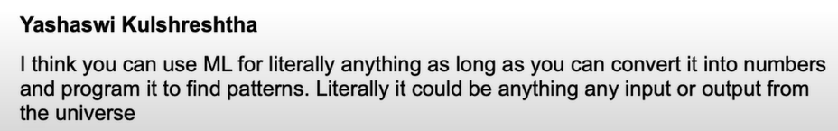

# tensorflow

## ML and DL

### What is deep learning?
A type of Machine Learning based on artificial neural networks in which multiple layers of processing are used to extract progressively higher level features from data.

### Machine Learning 😕
Turning things (data) into numbers and finding patterns in those numbers.

Finding Patterns? The computer does this part. How? Code & Math 😊 We are going to write the code 

In Nutshell: 

- Traditional Programming: Input -> Rules(algorithm) -> Output
- Machine Learning: Input + Output -> Rules(Algorithm)

### Why use ML and DL?
Good Reason: Why Not? 😎

Better Reason: For a complex probelm, can you think of all the rules?

### When you should not use ML?
If you can build a simple rule-based system that doesn't require machine learning, do that.

> Its Rule #1 of Google's Machine Learning Handbook

https://developers.google.com/machine-learning/guides/rules-of-ml

### What is Deep Learning good for?
- Problems with long list of rules: When the traditional approach fails, ML/DL may help.

- Continually changing environments: Deep Learning can adapt(learn) to new scenarios. 

- Discovering insights withing large collections of data: Can you imagine trying to hand-craft rules for what 101 different kinds of food look like?

### What is deep learning not good for?

- When you need explainability: the patterns learned by deep learning model are typically uninterpretable by a human.

- When the traditional approach is a better option: if you can accomplish what you need with a simple rule-based system. 

- When errors are unacceptable: since the outputs of deep learning model aren't always predictable. 

- When you don't have much data: deep learning models usually require a fairly large amount of data to produce great results.

### ML vs DL
- ML: Structured Data
- DL: Unstructured Data 🤔

## What is Tensorflow
1. End to End platform for Machine Learning
2. Write fast deep learning code in Python/other accessible languages(able to run on GPU/TPU)
3. Able to access many pre-built deep learning models (Tensorflow Hub)
4. Whole Stack: preprocess data, model data, deploy model in your application
5. Originally designed and used in-house by Google (now open-source)

### Why Tensorflow?
- Easy model building
- Robust ML Production anywhere
- Powerful experimentation for research

### TODO:
- Tensorflow basics and Fundamentals
- Preprocessing data (getting into tensors)
- Building and using pretrained deep learning models
- Fitting a model to the data (learning patterns)
- Making predictions with a model (using patterns)
- Evaluating model predictions
- Saving and Loading models
- Using a trained model to make predictions on custom data

### A Tensorflow Workflow
1. Get data ready (turn into tensors)
2. Build or pick a pretrained model (to suit your problem)
3. Fit the model to the data and make a prediction
4. Evaluate the Model
5. Improve through experimentation
6. Save and reload your trained model